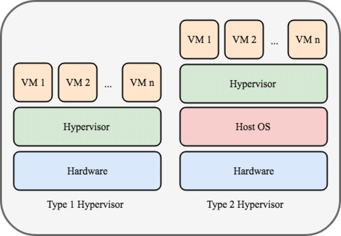

<strong>📕 Glossary</strong>

_Defines all the specific terms and vocabulary used throughout_

Participants should use this glossary to ensure consistency and avoid
the following happenstances.

- referring to the same thing using different names
- referring to different things using the same name (even worse)

  

---

 

<dl>
<dt>
  
#### `/etc/mtab`

</dt> 
<dd>

A dynamic file that identifies the currently mounted partitions on the Linux
system.

</dd>
</dl>

  

## A

  

## B

  

## C

 

<dl>
<dt>

#### Community Enterprise Operating System (CentOS)

</dt> 
<dd>

A Linux distribution derived from the sources of Red Hat Enterprise
Linux (RHEL).[^1]

</dd>
</dl>

  

## D

 

<dl>
<dt id="docker-image">

#### Docker image

</dt> 
<dd>

An _image_ is a read-only template with instructions for creating a
Docker container. Often, an image is _based on_ another image, with some
additional customization. For example, you may build an image which is
based on the `ubuntu` image, but installs the Apache web server and your
application, as well as the configuration details needed to make your
application run.[^2]

</dd>  
<dt id="docker-image-layer">

#### Docker image layer

</dt> 
<dd>

The order of Dockerfile instructions matter. A Docker build consists of
a series of ordered build instructions. Each instruction in a Dockerfile
roughly translates to an _image layer_. The following diagram illustrates
how a Dockerfile translates into a stack of layers in a container image.[^3]
  

<figure>
   
  <figcaption>From Dockerfile to layers</figcaption>
</figure>

  

Docker images have _intermediate layers_ that increase reusability,
decrease disk usage, and speed up docker build by allowing each step to
be cached. These intermediate layers are not shown by default.[^4]

Each `RUN` instruction will create a new layer in the resulting image.
Therefore squashing consecutive `RUN` instructions will reduce the layer
count (see https://docs.docker.com/develop/dev-best-practices/). In
addition to that, each `RUN` instruction runs in its own shell, which
can be the source of confusion when part of a `RUN` instruction changes
something about the environment, because these changes may vanish in the
next `RUN` instruction.[^4.1]

</dd>
</dl>

  

## E

 

<dl>
<dt></dt> 
<dd>

</dd>
</dl>

  

## F

 

<dl>
<dt id="facility">
  
#### facility

</dt> 
<dd>

The type of <mark>event log</mark>ged by [syslog][].

</dd> 
<dt>

#### Fedora

</dt> 
<dd>

The upstream source of the commercial Red Hat Enterprise Linux
distribution.[^5]

</dd>
</dl>

  

## G

 

<dl>
<dt></dt> 
<dd>

</dd>
</dl>

  

## H

 

<dl>
<dt>
  
#### Hypervisor

</dt> 
<dd>

Also known as a virtual machine monitor or VMM, is software that creates and
runs virtual machines (VMs). A hypervisor allows one host computer to support
multiple guest VMs by virtually sharing its resources, such as memory and
processing.[^6]

<dl>
  <dt>Type 1 Hypervisor</dt> 
  <dd>
    Also known as bare-metal or native hypervisor. It runs directly on the
    host's hardware and controls the hardware; manages and monitors guest
    operating systems, which run on a separate level above the hypervisor.
  </dd>
  <dt>Type 2 Hypervisor</dt> 
  <dd>
    Also known as hosted hypervisor. It runs as a software layer on an
    operating system (the host OS), like other computer programs. Guest
    operating systems run on a third level above the hardware (within host OS).
  </dd>
</dl>

  
<figure>
   
  <figcaption>Type 1 and type 2 hypervisors</figcaption>
</figure>

  

</dd>

</dl>

  

## I

 

<dl>
<dt></dt> 
<dd>

</dd>
</dl>

  

## J

 

<dl>
<dt></dt> 
<dd>

</dd>
</dl>

  

## K

 

<dl>
<dt></dt> 
<dd>

</dd>
</dl>

  

## L

 

<dl>
<dt></dt> 
<dd>

</dd>
</dl>

  

## M

 

<dl>
<dt></dt> 
<dd>

</dd>
</dl>

  

## N

 

<dl>
<dt></dt> 
<dd>

</dd>
</dl>

  

## O

 

<dl>
<dt>
  
#### Oracle VM VirtualBox

</dt> 
<dd>

Runs multiple Linux distributions at the same time, assuming that
hardware has enough resources.

</dd>
</dl>

  

## P

 

<dl>
<dt></dt> 
<dd>

</dd>
</dl>

  

## Q

 

<dl>
<dt></dt> 
<dd>

</dd>
</dl>

  

## R

 

<dl>
<dt id="rsyslogd">

#### `rsyslogd`

</dt> 
<dd>

A faster [`syslog`][] program for Linux.

</dd>
</dl>

  

## S

 

<dl>

<dt id="severity">
  
#### severity

</dt> 
<dd>

The importance of <mark>event log</mark>ged by [syslog][].

</dd> 
<dt id="syslog">
  
#### Syslog

</dt> 
<dd>

A de facto Unix and Linux protocol for storing event messages.

The syslog protocol has become the de facto standard for most Linux logging
applications. It identifies events using a [facility](#facility) code, which
defines the event type, and a [severity](#severity), which defines how important
the event message is. The [`sysklogd`][], [`syslogd-ng`][], and [`rsyslogd`][]
applications all use the syslog protocol for managing system and application
events in Linux.

</dd> 
<anchor id="syslogd"></anchor>
<anchor id="klogd"></anchor>
<anchor id="sysklogd"></anchor>
<dt>
  
#### `sysklogd`

</dt> 
<dd>

The original [Syslog][] application; includes two programs: the [`syslogd`][]
program to monitor the system and applications for events and the [`klogd`][]
program to monitor the Linux kernel for events.

</dd> 
<dt id="syslogd-ng">
  
#### `syslogd-ng`

</dt> 
<dd>

An application that is used to manage log messages and implement centralized
logging where the aim is to collect log messages of several devices on a single
and central log server.

</dd>
</dl>

  

## T

 

<dl>
<dt></dt> 
<dd>

</dd>
</dl>

  

## U

 

<dl>
<dt>
  
#### Ubuntu

</dt> 
<dd>

An open-source operating system based on the Debian Linux distribution.

</dd>
</dl>

  

## V

 

<dl>
<dt></dt> 
<dd>

</dd>
</dl>

  

## W

 

<dl>
<dt></dt> 
<dd>

</dd>
</dl>

  

## X

 

<dl>
<dt></dt> 
<dd>

</dd>
</dl>

  

## Y

 

<dl>
<dt>
  
#### Yet another Setup Tool (YaST)

</dt> 
<dd>

An operating system setup and configuration tool unique to openSUSE.
It can be thought of as a command-center utility; allows the control of
many system services from one interface.

</dd>
</dl>

  

## Z

 

<dl>
<dt></dt> 
<dd>

</dd>
</dl>

  

<!-- BEGIN LINK DEFINITIONS -->

[^1]: https://www.redhat.com/en/topics/linux/what-is-centos
[^2]: https://docs.docker.com/get-started/overview/#images
[^3]: https://docs.docker.com/build/guide/layers/
[^4]: https://docs.docker.com/engine/reference/commandline/images/#description
[^4.1]: https://app.deepsource.com/directory/analyzers/docker/issues/DOK-W1001
[^5]: https://docs.fedoraproject.org/en-US/quick-docs/fedora-and-red-hat-enterprise-linux/#relationship-between-fedora-and-red-hat-enterprise-linux
[^6]: https://www.vmware.com/topics/glossary/content/hypervisor.html
[^7]: https://download3.vmware.com/vcat/vmw-vcloud-architecture-toolkit-spv1-webworks/index.html#page/Cloud%2520Operations%2520and%2520Management%2FArchitecting%2520a%2520vRealize%2520Log%2520Insight%2520Solution%2FArchitecting%2520a%2520vRealize%2520Log%2520Insight%2520Solution.2.12.html%23

[`klogd`]: ./glossary.md#klogd
[`syslog`]: ./glossary.md#syslog
[`syslogd`]: ./glossary.md#syslogd
[`sysklogd`]: ./glossary.md#sysklogd
[`syslogd-ng`]: ./glossary.md#syslogd-ng
[`rsyslogd`]: ./glossary.md#rsyslogd

[Syslog]: ./glossary.md#syslog

<!-- END LINK DEFINITIONS -->
